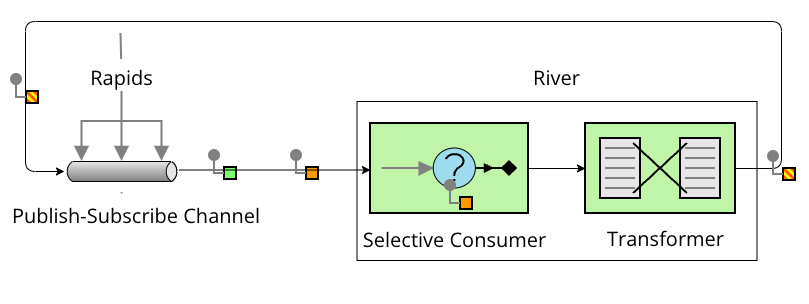
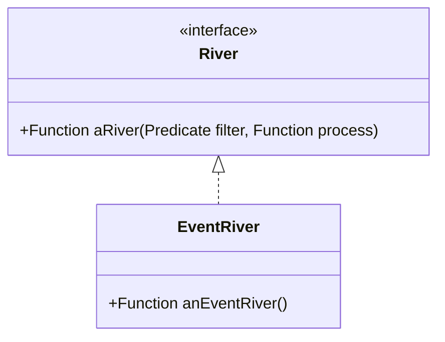

# Rapids, Rivers, Sources and Ponds

[](https://adoptium.net/temurin/releases/)
[](https://spring.io/projects/spring-boot)
[](https://cloudevents.io/)
[](https://spring.io/projects/spring-cloud-stream)
[](https://kafka.apache.org/)
[](https://www.rabbitmq.com/)
[](https://pulsar.apache.org/)
## Overview
How can I adapt Fred George's original idea of Rapids, Rivers, and Ponds simply and easily?

## Fred George's idea

* rapids are a PubSub channel that components publish events to
* rivers are Selective Consumers that forward events to a dedicated topic (or queue)
* Message Endpoints, e.g., Event-driven Consumers, subscribe to the rivers
  and process the events. 
  They may create new events and publish them on the rapid, or they might 
  update a database, which could be considered a Pond, or they might do something else.

As I understand it, Fred George envisioed the rivers to use a seperate channel from the rapid(s).

## The adaptation

 T


_**River**s are both a [Selective Consumer](https://www.enterpriseintegrationpatterns.com/patterns/messaging/MessageSelector.html) and [Publisher](https://www.enterpriseintegrationpatterns.com/patterns/messaging/PublishSubscribeChannel.html) of [Event Message](https://www.enterpriseintegrationpatterns.com/patterns/messaging/EventMessage.html)s 
on the **Rapids**, their shared [PubSub channel](https://www.enterpriseintegrationpatterns.com/patterns/messaging/PublishSubscribeChannel.html)._

or to put it the other way around:

_The **Rapids** are a [PubSub channel](https://www.enterpriseintegrationpatterns.com/patterns/messaging/PublishSubscribeChannel.html) shared by **River**s, which are both a [Selective Consumer](https://www.enterpriseintegrationpatterns.com/patterns/messaging/MessageSelector.html) and [Publisher](https://www.enterpriseintegrationpatterns.com/patterns/messaging/PublishSubscribeChannel.html) of its [Event Message](https://www.enterpriseintegrationpatterns.com/patterns/messaging/EventMessage.html)s._

I chose [CloudEvents](https://cloudevents.io/) for the event model and use [Spring Cloud Stream](https://spring.io/projects/spring-cloud-stream)
to implement the Rapids and Rivers and Ponds.

### The Rapids

The implementation is agnostic to the PubSub system chosen. I develop using

* Apache Kafka

but I also test with

* Broadcom RabbitMQ
* Apache Pulsar

which are supported by Spring Cloud Stream and can be configured in the application.yaml, i.e.,
without changing the code.

The Rapids are just a common destination name in the Spring Cloud stream configuration.

```properties
spring.function.definition=anEventRiver
dpring.cloud.stream.bindings.anEventRiver-in-0.destination=rapids
spring.cloud.stream.bindings.anEventRiver-out-0.destination=rapids
spring.cloud.stream.bindings.anEventRiver-in-0.group=anEventRiver-group
spring.cloud.stream.kafka.binder.brokers=${KAFKA_BROKERS:localhost:9092}
```
### The River(s)

Unlike Fred George's original idea, the River(s) are not a separate channel from the Rapids.12

A `River` is created by calling the default method of the `River` interface, `aRiver()`,
with a Predicate<CloudEvent> and a Function<CloudEvent, CloudEvent> as arguments.



### Example

```java
@Component
 public class EventRiver implements River {
   @Bean
   public Function<CloudEvent, CloudEvent> anEventRiver() {
     return aRiver(
       ce -> "event".equals(ce.getType()),
       ce -> CloudEventBuilder.v1(ce).withId(UUID.randomUUID().toString()).withType("event.processed").build()
     );
   }
 }
```

### The events

While Nav uses a proprietary event model that could have been inspired by Rich Hickey's approach to data in Clojure, I chose [CloudEvents](https://cloudevents.io/) for the event model and use [Spring Cloud Stream](https://spring.io/projects/spring-cloud-stream)


